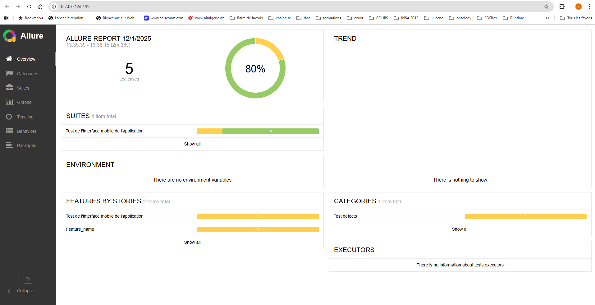
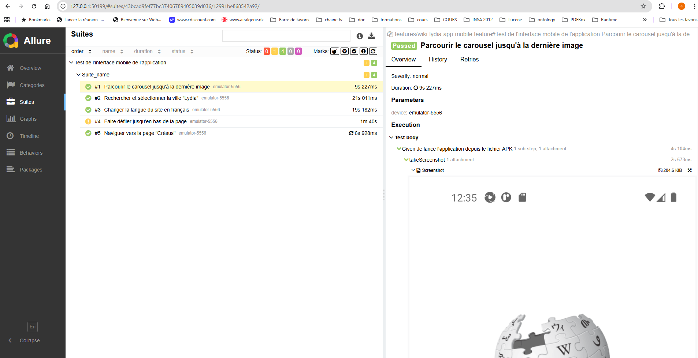

#Testing Mobile App Example
1. Test linéaire

Un exemple de test simple, composé de deux fonctions, réalisé après une légère modification du code généré automatiquement par Appium Inspector.

Pour exécuter ce test :

```
node lineare-test-case.js
```

2. Tests Gherkin - Cucumber

WDIO – Configuration utilisée

Voici la configuration générée via le wizard WebdriverIO :

```
===============================
🤖 WDIO Configuration Wizard 🧙
===============================

✔ A project was detected at "D:\Selenium\WebDriverIO", correct? Yes
✔ What type of testing would you like to do? E2E Testing - of Web or Mobile Applications
✔ Where is your automation backend located? On my local machine
✔ Which environment you would like to automate? Mobile - native, hybrid and mobile web apps, on Android or iOS
✔ Which mobile environment you'd like to automate? Android - native, hybrid and mobile web apps, tested on emulators and real devices
    > using UiAutomator2 (https://www.npmjs.com/package/appium-uiautomator2-driver)
✔ Which framework do you want to use? Cucumber (https://cucumber.io/)
✔ Do you want to use Typescript to write tests? Yes
✔ Do you want WebdriverIO to autogenerate some test files? Yes
✔ What should be the location of your feature files? D:\Selenium\WebDriverIO\features\**\*.feature
✔ What should be the location of your step definitions? D:\Selenium\WebDriverIO\features\step-definitions\steps.ts
✔ Do you want to use page objects (https://martinfowler.com/bliki/PageObject.html)? Yes
✔ Where are your page objects located? D:\Selenium\WebDriverIO\features\pageobjects\**\*.ts
✔ Which reporter do you want to use? allure
✔ Do you want to add a plugin to your test setup?
✔ Would you like to include Visual Testing to your setup? For more information see https://webdriver.io/docs/visual-testing! No
✔ Do you want to add a service to your test setup? appium
✔ Do you want me to run `npm install` Yes
```

Exécuter les tests
```
$ cd D:\Selenium\WebDriverIO
$ npm run wdio
```

Générer et ouvrir le rapport HTML Allure
```
npm run allure:generate
npm run allure:open
```
Exemples de rapports



